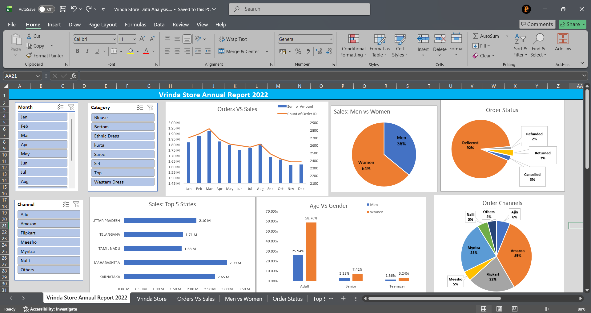

# Vrinda Store Sales Data Analysis (Excel Dashboard)

## Project Overview
This project focuses on analyzing the sales performance of Vrinda Store using Microsoft Excel. The objective is to transform raw sales data into meaningful insights and visualize them through an interactive dashboard.

The dashboard helps understand sales trends, customer demographics, order status, and channel performance.

## Tools Used
- Microsoft Excel
- Pivot Tables
- Pivot Charts
- Slicers
- Data Cleaning Techniques
- Data Visualization

## Dataset
The dataset contains order-level sales data including:

- Order ID
- Order Date
- Customer Gender
- Age Group
- Product Category
- Sales Amount
- Order Status
- Sales Channel
- State

The data was cleaned and transformed before building the dashboard.

## Data Cleaning Process
The following data cleaning steps were performed:

1. Checked for missing values.
2. Removed duplicate records.
3. Standardized categorical data (Gender, State, Category).
4. Created Age Groups (Teenager, Adult, Senior).
5. Converted order dates into month format for monthly analysis.

## Data Analysis Steps

### 1. Sales Trend Analysis
Using Pivot Tables, monthly sales and order counts were calculated to analyze sales trends throughout the year.

### 2. Gender-Based Sales Analysis
Analyzed the proportion of sales generated by men and women.

Result:
- Women contributed the majority of total sales.

### 3. Order Status Analysis
Orders were categorized based on their status:

- Delivered
- Cancelled
- Returned
- Refunded

Result:
Most orders were successfully delivered.

### 4. Top States by Sales
Identified the top 5 states contributing to the highest revenue.

Top performing states:
- Maharashtra
- Karnataka
- Uttar Pradesh
- Telangana
- Tamil Nadu

### 5. Age Group vs Gender Analysis
Sales were analyzed across different age groups:

- Teenager
- Adult
- Senior

Result:
Adults contributed the highest share of purchases.

### 6. Sales Channel Performance
Analyzed which e-commerce platforms generated the most orders.

Channels analyzed:
- Amazon
- Myntra
- Flipkart
- Ajio
- Meesho
- Nalli
- Others

Result:
Amazon generated the highest number of orders.

## Dashboard Features

The Excel dashboard includes:

- Interactive slicers
- Monthly sales trend
- Gender based sales distribution
- Order status breakdown
- Top states by sales
- Age vs gender analysis
- Order channel distribution

Users can filter the dashboard by:

- Month
- Product Category
- Sales Channel

## Key Insights

- Women contributed 64% of total sales.
- Most orders were successfully delivered (92%).
- Amazon is the top-performing sales channel.
- Adults are the primary customer segment.
- Maharashtra generated the highest revenue.

## Dashboard Preview

## Project Structure
